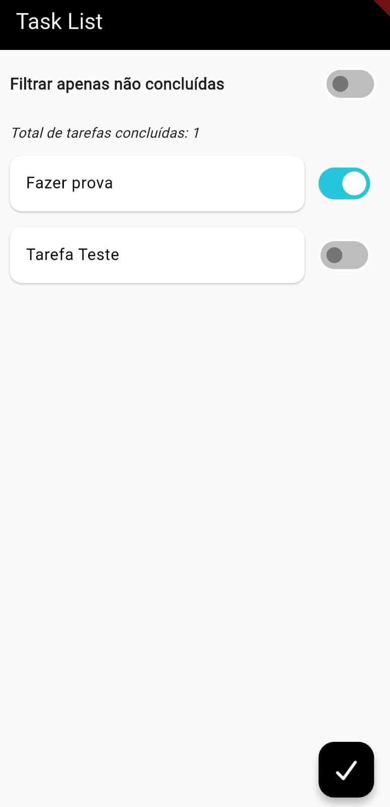

    <h1>🚀 To-Do Simples: Meu Início em Flutter! 💙</h1>
    
Este é o meu primeiro projeto pessoal em Flutter, uma lista de tarefas simples e funcional.

    

---

### 👋 Olá! :D

Decidi começar com este App de **Lista de Tarefas** porque todo mundo tem que começar por algum lugar. Este projeto me permitiu consolidar os fundamentos da framework **Flutter**.

---

### ✨ Funcionalidades Principais

| Ícone | Funcionalidade | Descrição |
| :---: | :--- | :--- |
| ➕ | **Criação de Tarefas** | Adicione novas tarefas de forma intuitiva. |
| 📊 | **Acompanhamento de Status** | Visualize a contagem de tarefas **✅ Concluídas** e **❌ Não Concluídas**. |
| 🔎 | **Filtro Avançado** | Filtre a lista para ver apenas as tarefas **Concluídas** ou **Não Concluídas**. |
| 💾 | **Persistência Local** | Os dados são salvos localmente, agindo como um banco de dados. |

---

### 📦 Tecnologia de Armazenamento Local

Para salvar as tarefas de forma local e eficiente, utilizei:

* **Hive:** Um pacote de armazenamento NoSQL, leve para persistência de dados no dispositivo.

---

### 🛠️ Como Rodar o Projeto

Para executar este projeto em sua máquina, você precisa ter o **Flutter SDK** configurado.

### 🚀 Próximos Passos

Ainda estou aprendendo e pretendo expandir o projeto no futuro com novas funcionalidades!

---